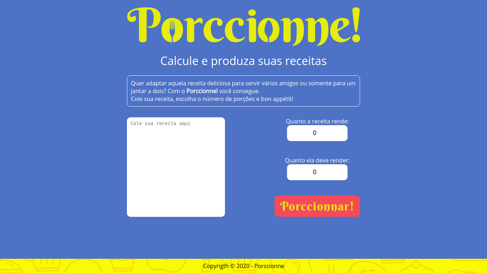
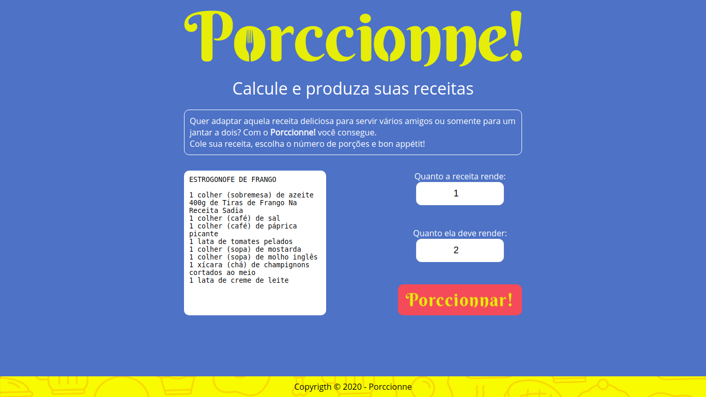

# Porccionne!

O Porccionne! é uma calculadora proporções para porções de receitas.

Esse projeto foi idealizado por @theOlldboy e executado por @gabriel-paiva, @murilogds e @eliseukadesh67.

## Acesse o Porccionne!

O Porccionne! está acessível no link: http://porccionne.herokuapp.com/

## A cara do Porccionne!



<br/>
<br/>



<br/>
<br/>


<br/>
<br/>

## Rodando o projeto localmente

1. Clone o projeto com o comando:

``` 
git clone https://github.com/gabriel-paiva/gota
```

2. Entre na pasta do projeto
``` 
cd gota
```

3. Instale as dependências
``` 
npm install
```

4. Suba o servidor de desenvolvimento
``` 
npm run dev
# ou
yarn dev
```

5. Acesse o projeto pelo navegador na URL: 
```
localhost:3000
```